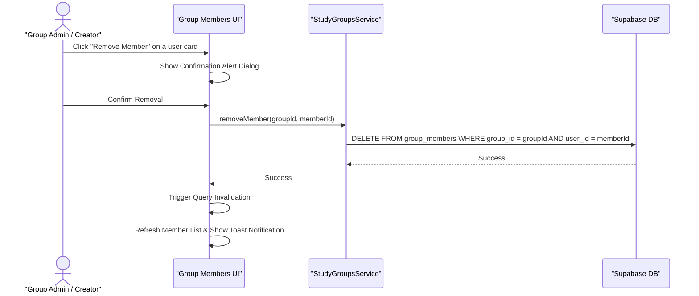

# Study Group Concepts & Specifications

This document outlines the detailed concepts, states, data models, roles, permissions, and lifecycle management for **Study Groups** in StudySync.

---

## 1. Core Data Models

Study groups and memberships are modeled in the database via two primary tables: `study_groups` and `group_members`.

### A. Study Group (`study_groups`)
A Study Group is a shared space for multiple users to coordinate sessions, chat, and share study materials.

| Field Name | Type | Description |
| :--- | :--- | :--- |
| `id` | `UUID` | Unique identifier for the group (Primary Key). |
| `name` | `String` | The display name of the study group. |
| `description` | `Text` (Optional) | Description of the group's focus, goals, or guidelines. |
| `subject` | `String` (Optional) | Category or course/subject (e.g., `"Computer Science"`, `"Mathematics"`). |
| `is_public` | `Boolean` | Visibility status: `true` for public, `false` for private/invite-only. |
| `max_members` | `Integer` (Optional)| Maximum size limit of the group. |
| `icon` | `String` | Icon key or data URL used for the group's visual avatar. |
| `color` | `String` | Tailwind-compatible CSS gradient or color class for the group's card styling. |
| `created_by` | `UUID` | Reference to `profiles.user_id` of the group creator. |
| `created_at` | `Timestamp` | Timestamp when the group was created. |

### B. Group Member (`group_members`)
A junction table representing the relationship between users and study groups.

| Field Name | Type | Description |
| :--- | :--- | :--- |
| `id` | `UUID` | Unique identifier for the membership row (Primary Key). |
| `group_id` | `UUID` | Foreign Key referencing `study_groups.id`. |
| `user_id` | `UUID` | Foreign Key referencing `profiles.user_id`. |
| `role` | `String` | Role of the member: `'admin'` or `'member'`. |
| `joined_at` | `Timestamp` | Timestamp when the user joined the group. |

### C. Group Invitations (`group_invitations`)
Tracks pending, accepted, or declined invitations for private groups.

| Field Name | Type | Description |
| :--- | :--- | :--- |
| `id` | `UUID` | Unique identifier for the invitation. |
| `group_id` | `UUID` | Foreign Key referencing `study_groups.id`. |
| `invited_user_id` | `UUID` | Foreign Key referencing `profiles.user_id` of the recipient. |
| `invited_by_id` | `UUID` | Foreign Key referencing `profiles.user_id` of the sender. |
| `status` | `String` | Current status of the invitation: `'pending'`, `'accepted'`, or `'declined'`. |
| `created_at` | `Timestamp` | Timestamp when the invitation was sent. |

---

## 2. Visibility & Access Rules

All Study Groups, regardless of their public or private status, are visible and discoverable to users (e.g. in search results, browse lists, or user profiles). The distinction lies in joining and access:

1. **Public Groups (`is_public = true`)**:
   - Discoverable by everyone in the **Browse Groups** page.
   - Any user can join directly (creating a `group_members` row with role `'member'`).
   - Non-members can view general group details, but must join to access chat and edit notes.

2. **Private Groups (`is_public = false`)**:
   - Discoverable by everyone in search and group browse lists.
   - Direct join is blocked. Joining strictly requires a pending invitation in `group_invitations` with `'pending'` status.
   - Access to internal details (chat, notes, active sessions, and member list) is restricted to members, creators, or users with pending invitations. Non-members will see the group metadata and an inline locked/invite-required notice.

3. **Browse Search & Course Filtering**:
   - The **Browse Study Groups** page includes dynamic search across group names, descriptions, and courses/subjects.
   - The subject dropdown dynamically aggregates all unique courses (`study_groups.subject`) from available public groups along with standard subject options, allowing users to toggle and filter groups by specific course (e.g., `"CS 1331"`, `"MATH 1552"`, `"Physics"`).

4. **Tab Query Parameter Persistence**:
   - The Study Groups page synchronizes active tab selection (`My Groups` vs `Browse Groups`) with URL query parameters (`?tab=...`) via `useTabQueryState`.
   - Refreshing the page while on `Browse Groups` (`/groups?tab=browse`) preserves the active tab, and exiting group details restores the previous tab.

---

## 3. Roles and Permissions Matrix

Permissions are structured hierarchically:

| Action | Creator | Admin | Member | Guest / Non-Member |
| :--- | :---: | :---: | :---: | :---: |
| **View Group Details** | Yes | Yes | Yes | Yes |
| **Join Group** | N/A | N/A | N/A | Public Groups / If Invited |
| **Leave Group** | Yes | Yes | Yes | N/A |
| **Edit Group Settings** | Yes | No | No | No |
| **Delete Group** | Yes | No | No | No |
| **Invite Members** | Yes | Yes | Yes | No |
| **Remove Members** | Yes | Yes | No | No |
| **Promote to Admin** | Yes | No | No | No |

### Single Admin Policy & Admin Succession
- **Single Admin Rule**: Each study group has exactly one admin (`role = 'admin'`).
- **Explicit Admin Transfer**: When an admin attempts to leave a group that has other members, the UI prompts the admin with a `TransferAdminModal` to explicitly select a replacement admin from the remaining members.
- **Zero-Member Auto-Deletion**: No group can exist without any members. If the sole remaining member (or admin) leaves or is removed, the study group and its associated data are automatically deleted from `study_groups`.

### Member Removal Hierarchy (New Feature)
To prevent admin abuse and maintain authority, member removal follows a strict validation hierarchy:
- **Creators / Admins** can remove regular members from the group.
- **Members** cannot remove anyone (they can only choose to leave the group themselves).

---

## 4. Row Level Security (RLS) Policies

To protect database operations and prevent recursive query loops, Row Level Security is implemented via non-recursive helper functions.

### Helper Functions
- **`public.is_group_creator(user_uuid, group_uuid)`**: Returns `true` if the user is the creator of the specified group.
- **`public.is_group_admin(user_uuid, group_uuid)`**: Returns `true` if the user is the group creator or has an `'admin'` membership role.

### Policies on `group_members`
- **SELECT**: Users can view memberships if they are the member, the creator, or if the group is public.
- **INSERT**: Authenticated users can insert their own membership (joining public groups or accepting invites).
- **DELETE**: 
  - A user can delete their own membership (leaving the group).
  - A group admin or creator can delete memberships of other users (removing a member).
- **UPDATE**: Group creators can update memberships (promoting/demoting).

### Policies on `group_invitations`
- **SELECT**: Senders (`invited_by_id`), recipients (`invited_user_id`), and group members/creators can view group invitations.
- **INSERT**: Authenticated users can create invitations or join requests as long as they are the sender (`auth.uid() = invited_by_id`).
- **UPDATE**: Recipients, senders, and group members/creators can update invitation status (e.g. accepting/declining).
- **DELETE**: Senders, recipients, or group creators can delete invitation records.

### Database Triggers & Validation Rules
- **Group Member Limit validation**: A `BEFORE INSERT` trigger (`tr_check_group_member_limit`) on `group_members` checks that the group's current member count does not exceed `max_members`. If the limit has been reached, database operations throw an exception: `'Group member limit of % reached'`.

---

## 5. User Flows

### A. Removing a Member

### B. Accepting/Declining Invitations
- When a user accepts an invitation, they are inserted into `group_members` as a `'member'` and the invitation status updates to `'accepted'`.
- When they decline, the invitation status updates to `'declined'`.

---

## 6. Real-Time Synchronization

Study groups support real-time updates for membership changes (joins, leaves, and kicks):
- **Database Replication**: The `group_members` table is enrolled in the `supabase_realtime` publication with `REPLICA IDENTITY FULL` to ensure delete event payloads replicate the `group_id` column to subscribers.
- **Client Subscription**: The `useGroupData` React hook establishes a Supabase Realtime channel subscription listening to changes on the `group_members` table for the active `group_id`.
- **Query Cache Invalidation**: Upon receiving a real-time event (`INSERT`, `UPDATE`, or `DELETE`), the client automatically invalidates the React Query cache key `['group', groupId]`, triggering a background refresh of the members list and instantly updating the user interface.

---

## 7. Edit Study Group Modal Layout Specification

The Edit Study Group modal (`GroupSettingsDialog.tsx`) provides group creators/admins with a unified dark-mode single-page configuration dialog:

- **Positioning**: Uses viewport-centered modal styling (`StandardDialogContent`) with `max-h-[90vh]` and `overflow-y-auto` to prevent dialog overflow at the bottom of the screen.
- **Header**: Contains the modal title `"Edit study group"`, a `...` action menu (with **Delete Group** trigger), and a `X` close button.
- **Group Image**: A square thumbnail avatar preview alongside an `"Upload image"` button supporting PNG/JPG files up to 5MB.
- **Group Name**: Text input field mapped to `study_groups.name`.
- **Course**: Text input field mapped to `study_groups.subject`.
- **Description**: Textarea field mapped to `study_groups.description`, featuring a live character counter (`x/500 characters`).
- **Member Limit**: Stepper control with `-` / `+` buttons and a numeric input box mapped to `study_groups.max_members`.
- **Who Can Join**: Segmented pill toggle control switching between `"Anyone can join"` (`is_public = true`) and `"Requires approval"` (`is_public = false`).
- **Footer**: Contains `"Cancel"` and `"Save changes"` buttons to persist updates or close the modal.

