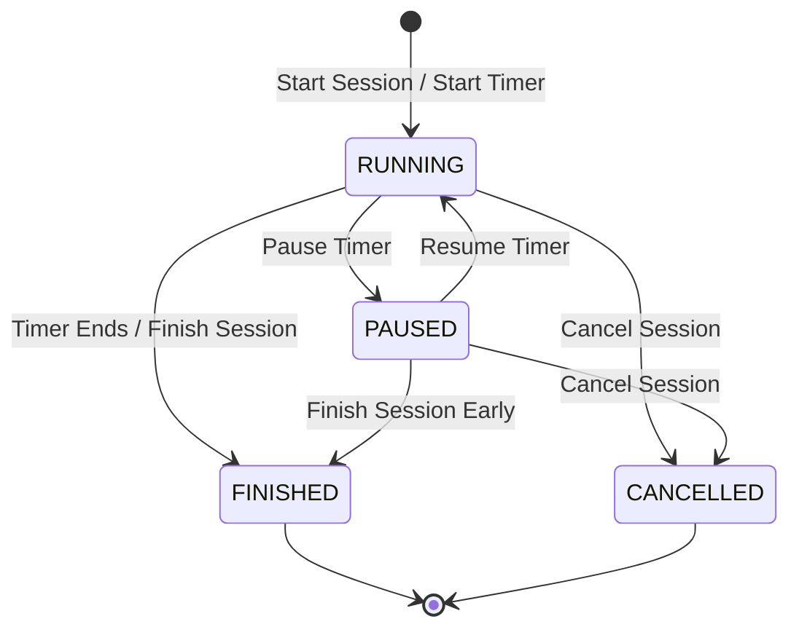

# Study Session Concepts & Specifications

This document outlines the detailed concepts, states, data models, and edge cases for **Solo Study Sessions** and **Group Study Sessions** in StudySync.

---

## 1. Core Data Models

To support tracking time accurately (especially when pausing/resuming) and to categorize study activity, we propose the following models.

### A. Solo Study Session
A Solo Study Session is a focused period of work by a single user.

| Field Name | Type | Description |
| :--- | :--- | :--- |
| `id` | `UUID` | Unique identifier for the session. |
| `created_by` | `UUID` | References `profiles.id` (the owner). |
| `subject` | `String` (Optional) | Category or subject (e.g., `"Mathematics"`, `"Computer Science"`). |
| `title` | `String` | Brief title or goal (e.g., `"Prep for Exam 2"`, `"Pomodoro Block 1"`). |
| `description` | `Text` (Optional) | Sub-tasks, goals, or notes for the session. |
| `target_duration` | `Integer` | Planned duration of study in minutes or seconds. |
| `actual_start` | `Timestamp` (Null) | Set when the session first enters the `RUNNING` state. |
| `actual_end` | `Timestamp` (Null) | Set when the session enters `FINISHED` or `CANCELLED`. |
| `total_paused_duration` | `Integer` | Sum of all paused time (in seconds) to compute true work time. |
| `state` | `Enum` | Current session state: `RUNNING`, `PAUSED`, `FINISHED`, `CANCELLED` (or `SCHEDULED` for future planning). |

### B. Group Study Session
A Group Study Session extends the core session concept with cooperative multi-user features.

| Field Name | Type | Description |
| :--- | :--- | :--- |
| *All Solo Fields* | *Varies* | Inherits basic timing, subject, and state fields. |
| `group_id` | `UUID` (Optional) | References a formal `study_groups.id` if associated with a group. |
| `max_participants`| `Integer` (Optional) | Limits how many users can join. |
| `participants` | `Array` / Join Table | List of users currently in or invited to the session. |

#### Participant Sub-Model (`session_participants`)
For relational databases like Supabase, participants are tracked via a relation table:
- `session_id` (`UUID`): References `study_sessions.id`.
- `user_id` (`UUID`): References `profiles.id`.
- `joined_at` (`Timestamp`): Time the user joined.
- `left_at` (`Timestamp` | Null): Time the user left.
- `role` (`Enum`): Host vs. Participant.
- `status` (`Enum`): `active`, `away`, or `left`.

---

## 2. State Machine

A study session behaves as a state machine. It is essential that state transitions are governed by strict business logic to maintain high data integrity.



### Transition Matrix & Behaviors

*   **`RUNNING` $\rightarrow$ `PAUSED`**: Calculates the active study time segment and starts tracking pause duration.
*   **`PAUSED` $\rightarrow$ `RUNNING`**: Appends the pause duration to `total_paused_duration` and resumes the work timer.
*   **`RUNNING` / `PAUSED` $\rightarrow$ `FINISHED`**: Saves the `actual_end` timestamp. Calculates the final `work_duration` (Actual Work Duration = `actual_end` - `actual_start` - `total_paused_duration`).
*   **`RUNNING` / `PAUSED` $\rightarrow$ `CANCELLED`**: Records that the session was abandoned. Discards progress metrics (or saves them separately as an incomplete session).

---

## 3. What Else to Account For? (Recommendations)

To make StudySync feel premium and robust, we recommend accounting for the following design considerations:

### 1. Pause Logs (Interval Tracking)
Instead of just maintaining a cumulative `total_paused_duration` counter, save a log of pause-resume timestamps.
*   **Why?** If the user closes the app, experiences a network dropout, or refreshes the page, you can reconstruct the exact timer state and verify compliance.
*   **Schema Addition**:
    ```typescript
    interface PauseInterval {
      paused_at: string; // ISO timestamp
      resumed_at: string | null; // ISO timestamp
    }
    ```

### 2. Pomodoro & Custom Work/Break Cycles
Many students do not just study continuously; they use Pomodoro cycles (e.g., 25 mins work, 5 mins break).
*   **Recommendation**: Introduce a `timer_mode` field (`'work' | 'break'`) and a `current_cycle` number.
*   **States**: Under `RUNNING`, is the user working or on break? You could track:
    - `running_state`: `'work'` or `'break'`
*   This makes the session stats much richer (e.g., "Completed 3 Pomodoro cycles during this session").

### 3. Session Reflection / Mindfulness
At the end of a session, study quality isn't just about time—it's about productivity.
*   **Recommendation**: When transitioning to `FINISHED`, show a **"Session Reflection"** modal:
    - **Self-Rating**: 1–5 stars on focus.
    - **Distraction Level**: Low, Medium, High.
    - **Notes/Achievements**: "Finished chapter 4 exercises".
*   This data feeds directly into a dashboard analytics graph.

### 4. Group Host Control & Synchronization
In a group session, who is in control of the state?
*   **Recommendation**:
    - **Host-Led Timer**: Only the host can `Pause`, `Resume`, or `Finish` the session. The state is synchronized to other participants in real-time (using Supabase Realtime/Presence).
    - **Collaborative Timer**: Any user can pause, but it requires a confirmation, or users pause their own personal stream within the shared lobby.
*   Clearly define the participant `role` (`host` or `member`) to enforce these permissions.

### 5. Idle Presence Detection (Group Sessions)
If a user walks away from their keyboard or closes the tab during a group session, they shouldn't skew the group's presence status.
*   **Recommendation**: Use a heartbeat or browser inactivity listener (e.g., mouse movement/keyboard inputs) that prompts the user if they're still studying. If no response, update their participant status to `away` and pause their individual contribution.

### 6. Associated Resources
Students create notes or select documents while studying.
*   **Recommendation**: Create a join table linking `notes` to `study_sessions` (or keep the existing `notes.session_id` foreign key) so users can look back at a session and see exactly what notes were created or edited during it.

---
